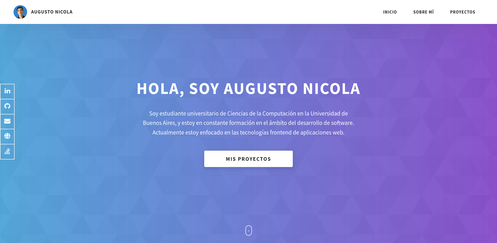

# **Portfolio**

### *Mi portfolio personal de proyectos y herramientas.*

### **Portfolio en línea: https://augustonicola.netlify.app**

 

### [English README here :uk: :us:](README-EN.md)

 

Este es el código fuente de mi página web personal de portfolio, en la que presento información sobre mis habilidades y experiencias. Hecha con HTML, SCSS y JavaScript.

El diseño está basado en la plantilla de portfolio ["Dopefolio"](https://github.com/rammcodes/Dopefolio) diseñada por [Ram Maheshwari](https://github.com/rammcodes).

Los íconos visuales utilizados a lo largo del proyecto son propiedad de [Font Awesome](https://fontawesome.com/).

 

# Instalación y Uso Local
Para poder editar localmente la página, seguir estos pasos:

1. **Clonar el repositorio y moverse a la carpeta de destino**
	
		$ git clone https://github.com/AugustoNicola/Portfolio
		$ cd Portfolio/
	
2. **Instalar las dependencias necesarias (`node-sass`)**
		
		$ npm install

¡Listo, el proyecto debería estar configurado correctamente! Para compilar las modificaciones hechas a los archivos SCSS, se puede utilizar la extensión [Live SASS](https://marketplace.visualstudio.com/items?itemName=ritwickdey.live-sass), o bien usar el comando con la dependencia `npm run build`.

 

## Comandos

* `npm run build`: Lee los archivos de la carpeta `scss` y los compila en `css/main.css` para ser usados por las páginas estáticas.

 

# Contribuciones y Licencia
Este proyecto está bajo la [Licencia GPL v3.0](https://choosealicense.com/licenses/gpl-3.0/). **Podés leer, usar o modificar el código que necesites, ¡pero es necesario que mantengas la licencia y hagas públicas dichas modificaciones!**

Cualquier aporte de código, pull request, notificación de errores o fallas, sugerencias o cualquier otro tipo de contribución será enormemente agradecida.

Nuevamente, agradecimientos a Ram Maheshwari por crear la plantilla de portfolio en la que se basa este trabajo. :raised_hands:

¡Espero que te haya gustado mi trabajo! :+1: